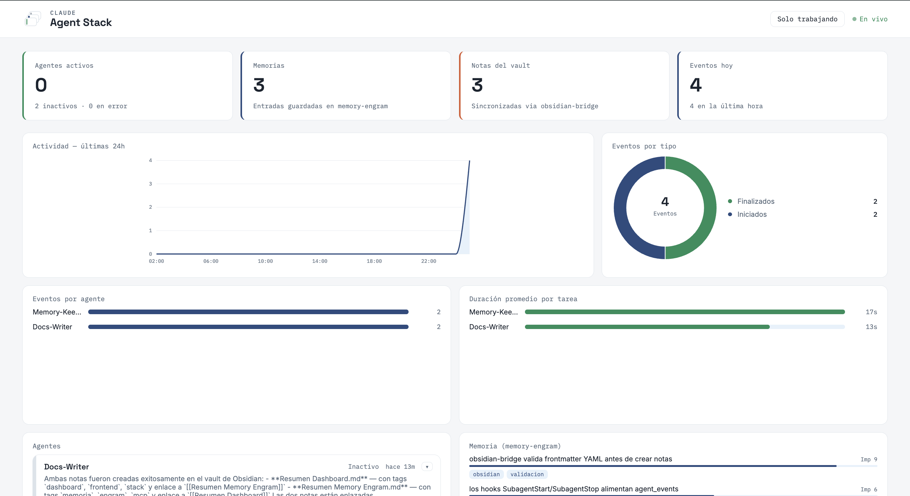
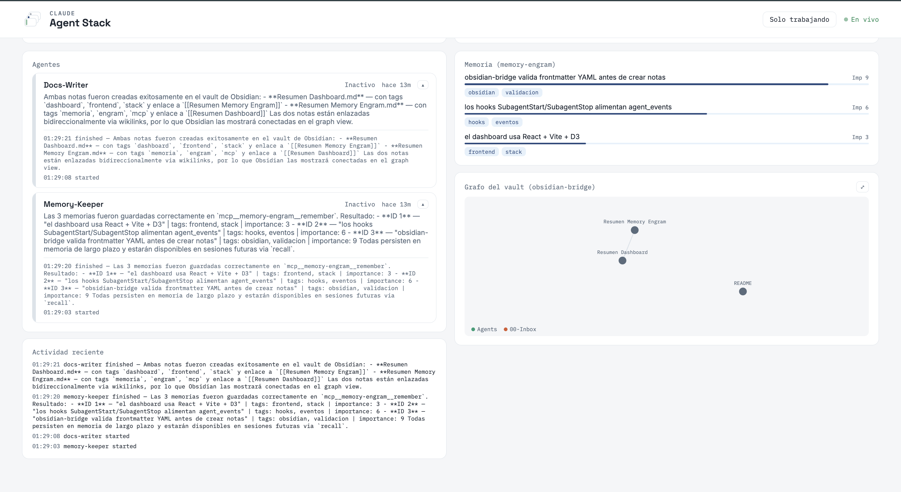

# Claude Agent Stack

Un stack de desarrollo completo para orquestar agentes de IA con **Claude Code**: orquestador + subagentes especializados, memoria persistente propia, integración con **Obsidian**, **skills** reutilizables, servidores **MCP** (incluyendo **Context7**), y un **dashboard en vivo** con grafo interactivo del vault y panel de memoria.

## Tabla de contenidos

- [Qué incluye](#qué-incluye)
- [Requisitos previos](#requisitos-previos)
- [Instalación](#instalación)
- [Cómo se usa](#cómo-se-usa)
- [El dashboard](#el-dashboard)
- [Configuración](#configuración)
- [Uso opcional con API key](#uso-opcional-con-api-key)
- [Estructura del repositorio](#estructura-del-repositorio)
- [Solución de problemas](#solución-de-problemas)
- [Roadmap](#roadmap)

## Qué incluye

| Componente | Tecnología | Estado |
|---|---|---|
| Orquestador + 4 subagentes | Claude Code nativo (`.claude/agents/*.md`) | ✅ |
| `memory-engram` | Node.js + TypeScript + SQLite | ✅ probado |
| `obsidian-bridge` | Node.js + TypeScript | ✅ probado |
| Vault de Obsidian de ejemplo | Markdown | ✅ |
| Skill de ejemplo | Markdown + YAML | ✅ |
| Context7 | MCP remoto oficial | ✅ configurado |
| Dashboard (agentes + memoria + grafo del vault) | Node/Express/WebSocket + React + D3 | ✅ probado |

## Requisitos previos

| Requisito | Versión | Verificar |
|---|---|---|
| Node.js | 18+ (recomendado 20, ver `.nvmrc`) | `node --version` |
| Claude Code | última | `claude --version` |
| Git | cualquiera reciente | `git --version` |
| Obsidian (opcional) | cualquiera | — |

Si ya usas Claude Code con suscripción Pro/Max, **eso es todo lo que necesitas** para autenticarte — no hace falta ninguna API key.

> Si usas `nvm`, corre `nvm use` en la raíz del proyecto (hay un `.nvmrc`) **antes** de instalar nada, y usa la misma terminal/versión para todos los pasos — mezclar versiones de Node entre carpetas rompe los módulos nativos (`better-sqlite3`).

## Instalación

```bash
git clone https://github.com/tu-usuario/claude-agent-stack.git
cd claude-agent-stack
bash scripts/setup.sh
```

Esto instala y compila `memory-engram`, `obsidian-bridge` y el dashboard (backend + cliente). No pide ni necesita ninguna credencial.

Luego, en la misma carpeta:

```bash
claude
```

Con tu sesión ya autenticada, eso es todo. Claude Code detecta automáticamente los subagentes, los servidores MCP (definidos en `.mcp.json`, habilitados vía `enableAllProjectMcpServers` en `.claude/settings.json`) y las skills.

Verifica la conexión:

```
> ¿Qué servidores MCP tengo disponibles?
```

Deberías ver `context7`, `memory-engram` y `obsidian-bridge`.

**Importante:** si editas `.claude/settings.json` con la sesión de Claude Code ya abierta, tienes que **salir (`/exit`) y volver a abrir `claude`** para que tome los cambios — los hooks se cargan al iniciar la sesión.

## Cómo se usa

```
> Usa el agente orchestrator para investigar cómo funciona el rate
  limiting en Express y documenta lo que encuentres en el vault
```

Esto dispara el flujo completo: `orchestrator` delega a `researcher` (que consulta Context7), luego a `docs-writer` (que crea una nota en el vault vía `obsidian-bridge`).

Memoria persistente:

```
> Recuerda que este proyecto usa Node.js y TypeScript
> ¿Qué tecnología usa este proyecto?
```

## El dashboard





Dos terminales:

```bash
# Terminal A
cd dashboard/server && npm run dev

# Terminal B
cd dashboard/client && npm run dev
```

Abre `http://localhost:5173`. Verás en vivo: tarjetas de agentes (clic en la flecha para ver su historial), panel de memoria con barra de importancia y tags, grafo interactivo del vault (arrastra los nodos, pasa el cursor para resaltar conexiones, clic en ⤢ para verlo en pantalla completa), y un feed de actividad.

Detalle completo en [`dashboard/README.md`](dashboard/README.md).

## Configuración

Todo vive en `config/config.yaml` (sin secretos) y `.env` (opcional, ver abajo). Para agregar tus propios subagentes o skills, copia un archivo existente en `.claude/agents/` o `skills/` y ajusta la `description`.

## Uso opcional con API key

**Esto no aplica si ya usas Claude Code con tu suscripción — sáltate esta sección.**

Para correr el orquestador de forma desatendida (CI, servidor): copia `.env.example` a `.env`, completa `ANTHROPIC_API_KEY`, y cambia `orchestration.engine` a `api` en `config/config.yaml`.

## Estructura del repositorio

```
claude-agent-stack/
├── .claude/
│   ├── settings.json          # permisos + hooks + enableAllProjectMcpServers
│   └── agents/                # orchestrator, researcher, coder, docs-writer, memory-keeper
├── .mcp.json                   # definición de los servidores MCP (context7, memory-engram, obsidian-bridge)
├── config/config.yaml          # configuración del proyecto (sin secretos)
├── skills/example-skill/
├── mcp-servers/
│   ├── memory-engram/          # servidor MCP de memoria (Node.js/TS + SQLite)
│   └── obsidian-bridge/        # servidor MCP del vault (Node.js/TS)
├── vault-demo/                 # vault de Obsidian de ejemplo
├── dashboard/
│   ├── server/                 # backend Express + WebSocket
│   └── client/                 # frontend React + D3
├── docs/ARCHITECTURE.md
└── scripts/setup.sh
```

## Solución de problemas

**"Claude Code no detecta los servidores MCP"** — verifica que compilaste ambos: `ls mcp-servers/memory-engram/dist` y `ls mcp-servers/obsidian-bridge/dist` deben mostrar `index.js`.

**"Error de better-sqlite3 al instalar / NODE_MODULE_VERSION mismatch"** — instalaste con una versión de Node y corres con otra. Corre `nvm use` en la raíz antes de instalar nada, y reinstala (`rm -rf node_modules package-lock.json && npm install`) en `mcp-servers/memory-engram`, `mcp-servers/obsidian-bridge` y `dashboard/server` con esa misma versión activa.

**"Edité settings.json pero no pasa nada"** — reinicia la sesión de Claude Code (`/exit` y volver a abrir `claude`); los hooks se cargan solo al iniciar.

**"El dashboard no muestra ningún agente"** — verifica `http://localhost:4000/api/health`. Genera un evento de prueba: `node mcp-servers/memory-engram/dist/log-event.js coder started "prueba"`.

**"El grafo del vault aparece vacío"** — asegúrate de tener al menos una nota `.md` en `vault-demo/` con frontmatter válido; el panel actualiza cada 8 segundos.

## Roadmap

- [x] Orquestador + subagentes + skills
- [x] `memory-engram` + `obsidian-bridge`, probados end-to-end
- [x] Dashboard completo: agentes, memoria, grafo del vault, modal de pantalla completa

## Licencia

MIT — ver [`LICENSE`](LICENSE).
